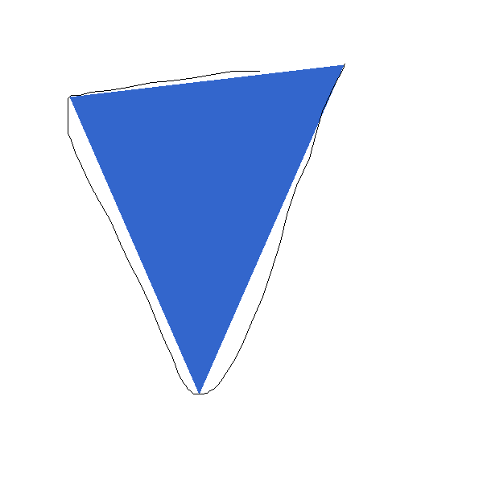
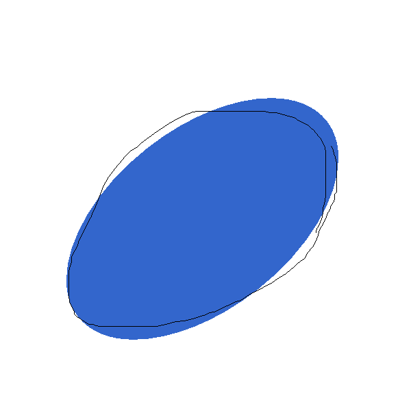

# Shape Recognize

Example of simple algorithm to recognize shape from array of points.

## Build

Clone repository and start following command:

```sh
mvn package assembly:single
```

## Usage

Start application using following command:

```sh
java -jar target/recognize-shape-1.0-jar-with-dependencies.jar
```

You can draw any shape using left mouse button. After shape is drawn algorithm
will recognize the shape. Algorithm recognizes only polygons with 3-5 points
and circles.

## Examples







